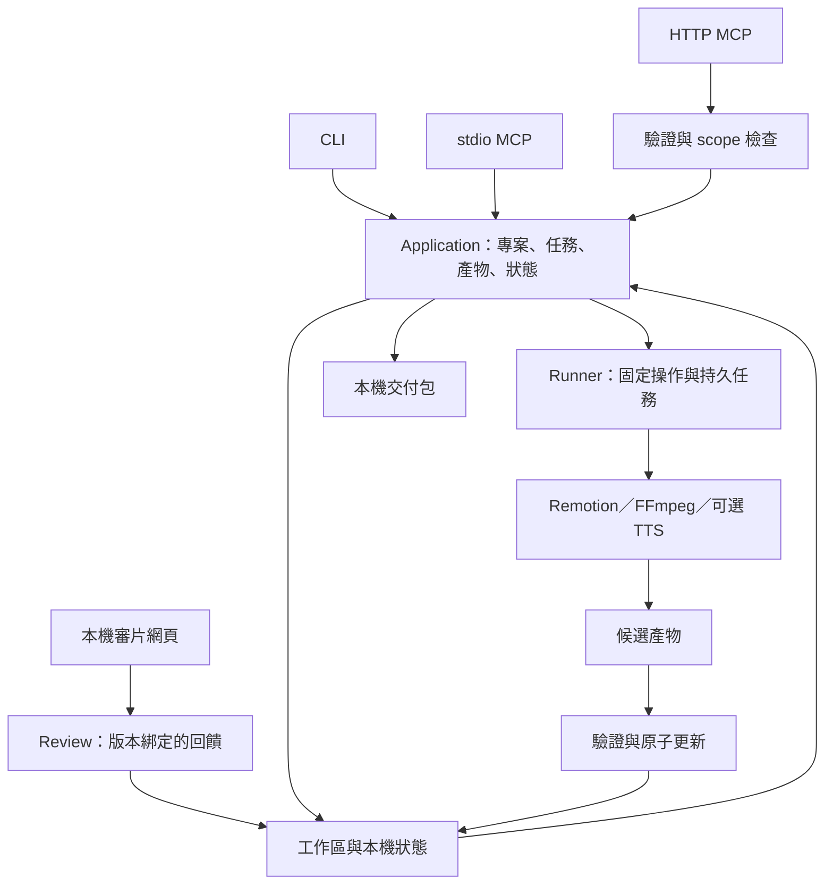

# Video Studio 功能實作計畫

日期：2026-09-19。狀態：可供實作拆分與審閱的設計提案，尚未實作。

**已確認的產品方向**

Video Studio 是使用者自行安裝的影片工作流軟體。提供兩種完整入口：CLI，以及使用者自行架設的 MCP。MCP 同時支援本機 stdio 與有驗證的私人伺服器 HTTP；兩種入口都可以搭配網頁審片。

我們不提供雲端、代管、帳號訂閱、平台計費、共享算力或媒體託管。程式、專案、工作紀錄與影片留在使用者設備或自備伺服器。付費模型服務為選配，由使用者自行設定供應商與金鑰；使用第三方 API 不等於使用我們的雲端。

第一版以已會使用終端機或 AI agent 的個人創作者為對象。單一安裝是一個可信任工作區，可有多個協作 agent，但不是多租戶執行平台。任意 Remotion／Node 專案能執行程式碼，因此只處理使用者信任的專案；MCP 權限及 lease 不構成不可信程式碼沙箱。

以下命令、tool 名稱、schema 與目錄均為目標設計；README 在實作驗證前不可將它們列為已可使用。

**v0.1 完成後的使用體驗**

| 入口 | 使用者可完成的事 | 執行位置 |
| --- | --- | --- |
| CLI | 安裝檢查、建立專案、匯入素材、驗證腳本／分鏡、產生旁白、渲染、看進度、取消／恢復、QA、匯出 | 本機或 SSH 登入自己的伺服器 |
| stdio MCP | 由 agent 執行相同工作，取得結構化 blocker、產物清單和可執行的下一步 | MCP client 啟動本機 subprocess |
| HTTP MCP | 由通過驗證的 MCP client 呼叫相同功能；斷線後仍可查回任務 | 使用者自己的伺服器 |
| 網頁審片 | 看專案與版本、播放、字幕與聲音試聽、時間點留言、回饋狀態、匯出回饋 | 本機 localhost；伺服器模式先透過 SSH tunnel 存取 |

第一個成功旅程：安裝 → doctor → 建立中性範例 → 讀取下一步 → 渲染 15–30 秒影片 → 自動 QA → 人工觀看並留言 → agent 修正 → 再渲染 → 確認舊留言屬於舊版 → 匯出影片／字幕／封面／來源與 QA 摘要。

範例使用明確可再散布的預製旁白與幾何素材，不呼叫付費 API。無需模型帳號不代表安裝完全離線：初次安裝可能下載 Rust／Python／Node 相依和瀏覽器；安裝完成後的範例製作須可在禁止對外網路的環境完成。

**範圍與版本**

| 功能 | v0.1 | 後續 |
| --- | --- | --- |
| CLI、stdio、HTTP MCP | 都是正式入口，共用核心；HTTP 有驗證 | 更多 client 相容性 |
| Project／artifact／job／lease／receipt | 必備 | 跨機器工作轉移、增量段落快取 |
| 素材 | 匯入既有本機檔案，登記來源與使用權說明 | stock 搜尋、遠端下載、圖片／影片生成 adapter |
| 旁白 | 自帶音訊＋SRT、試聽與同步檢查 | 首個選配 ElevenLabs adapter、更多 TTS／STT、G2P 模型與發音 A/B |
| 影片 | 一條 Remotion renderer，中性旁白模板，16:9／9:16 | HyperFrames／Motion Canvas、多人對話、長片分段 |
| QA | 解碼、時長、音訊、字幕時間、場景邊界／黑幀等客觀檢查；人工回饋 | 獨立視覺模型評估與強核准 |
| 審片 | 版本、播放、時間點回饋、回饋匯出 | A/B、封面比較、多人遠端審片、剪輯時間線 |
| 輸出 | 成片、SRT、封面、交付 manifest | YouTube 等平台發布 adapter |
| 部署 | macOS arm64 本機＋Ubuntu 24.04 LTS x86_64（S1 確認相依）；source install | 已驗證的 Windows／Linux arm64、預編譯發行品、Docker image |
| 發布 | `publish=unsupported`，沒有上傳端點和憑證讀取路徑 | 使用者自備 OAuth、正式核准與去重上傳 |

v0.1 的技術 QA 和本機回饋不宣稱為原 Haru 系統的硬體簽章核准。匯出是本機交付操作，不是平台發布。原系統的核准規則保持原樣，不能把它的 `pass` 改成較弱的意思。

**架構：兩個入口共用一套行為**

沿用 Rust 管理 application、MCP、lease 與任務交易；Python 負責既有媒體／QA 邏輯和 FastAPI 審片介面；Node 僅用於 Remotion 專案。先採單一 repo 與既有工具鏈；job／lease 交易採嵌入式 SQLite，無需資料庫服務。不增加工作流引擎、訊息佇列、Postgres 或新的前端框架。

模組設計如下，檔案布局在抽取時以最小必要變更為準：

| Module／預期位置 | Interface 與責任 | 不應放入 |
| --- | --- | --- |
| `pipeline/src/application.rs` | create、inspect、produce、run、job、verify、export；統一回應及行為 | CLI 專用繞過規則、UI 專用 ready 判斷 |
| `pipeline/src/project.rs`、`artifact.rs` | schema、產物角色、內容摘要、依賴、變更失效 | 靠檔名推測真實影片身份 |
| `pipeline/src/jobs.rs`、`lease.rs` | durable job、idempotency、工作所有權、恢復與取消 | request 結束就消失的任務狀態 |
| `pipeline/src/runtime.rs` | 已安裝版本、來源閉包、worker 啟動與升級相容性 | 寫死 Haru 私人遠端、agent 可任意修改信任來源 |
| `pipeline/src/cli.rs`、`mcp/` | 參數與 protocol 轉換，同一 application Interface | 各自再實作一套製作流程 |
| `tools/` | 音訊／字幕／render／QA adapters，固定 argv 和結構化結果 | 第二個私人 checkout、任意 shell 指令 tool |
| `tools/dashboard/` | 讀取 application projection、播放媒體、版本綁定回饋 | 寫入製作 pass、發布核准或執行 agent 任意命令 |
| `templates/`、`examples/` | 原創中性模板與短範例、來源及授權清單 | 真實製作案、Haru 角色、付費音色或私有素材 |

Application 由 workspace coordinator 提供，CLI 和 MCP 透過 owner-only Unix socket 呼叫相同 Interface；每個 workspace 同時只有一個 coordinator，使用程序鎖避免啟動競爭。它可以內部沿用現有 Python 狀態 evaluator；它的回傳是唯一對外狀態。CLI／MCP／Dashboard 不各自維護 ready 條件。Review 儲存先保留現有原子 JSON＋檔案鎖；現有 `ReviewStore` 並非 SQLite。新 SQLite 僅承接需要多欄位原子交易的 jobs／lease／revision／產物 current pointer／成本預留，不趁抽取重寫審片儲存。

**CLI 與 MCP 功能對照**

命令統一為 `video-studio`。所有 project 操作用已登記的 `project_id`；MCP 不接受 client 自選的任意 workspace root。CLI 的本機路徑先由 import 登記成 artifact，再交給核心。

| CLI 目標 Interface | MCP 目標 tool | 主要結果 |
| --- | --- | --- |
| `doctor --json` | `runtime_info` | 版本、依賴、支援能力、修復提示；不列金鑰 |
| `project create <slug> --template narrated` | `project_create` | project ID、必要產物、下一步；placeholder 不算完成 |
| `project list`、`project status <id>` | `project_list`、`project_status` | 完成／缺少／過期的 stage 與明確 blocker |
| `artifact import <id> --from <path> --role <role>` | `artifact_import` | 驗證、複製到專案、來源／hash；HTTP 限已配置 inbox 內的相對檔案 |
| `artifact produce <id> --role <role> --from <path>` | `artifact_produce` | 通過 schema 的腳本／分鏡；核心接收 staged blob ID，HTTP 使用 inbox reference 或有大小上限的 inline text |
| `artifact list <id>` | `artifact_list` | role、版本、SHA、可見來源與驗證結果 |
| `run <id> --runner <name> [--wait]` | `run_next` | `job_id` 或明確拒絕；runner 來自 allowlist |
| `job status/logs/cancel/resume <job_id>` | `job_status`、`job_logs`、`job_cancel`、`job_resume` | 當前狀態、可恢復點與受限制、去敏的 log |
| `verify <id>` | `project_verify` | 重新讀取實際產物證據，不產生虛假 pass |
| `review feedback <id> [--format markdown]`、`review comment/add/resolve` | `review_feedback`、`review_comment_add`、`review_comment_resolve` | 帶版本／時間點的回饋與處理狀態，沿用網頁相同驗證；舊版另列 |
| `export <id> --destination <dir>` | `project_export` | 交付 manifest、各檔 hash；HTTP 僅寫 server 配置的 export root |
| `ui serve` | 無 | 在 loopback 啟動網頁，展示相同工作區 |
| `mcp serve --transport stdio` 或 `http` | 無 | 啟動使用者自架 MCP |

CLI 預設輸出可讀文字，`--json` 回傳 `schema_version, outcome, code, project_id, job_id, data, blockers, next_actions`。MCP tool 使用相同業務 payload，protocol errors 仍依 MCP 表達。長任務預設回傳 accepted，不能把 accepted 顯示成 rendered；`--wait` 才等待 terminal result。日誌走 stderr，stdio MCP stdout 僅有 protocol messages。[MCP transports](https://modelcontextprotocol.io/specification/2025-11-25/basic/transports)

Exit code 初版定義：0＝命令成功（非等待提交可為 accepted）、2＝輸入不合法、3＝前置關卡阻擋、4＝任務失敗、5＝環境／內部錯誤、6＝衝突／忙碌、130＝互動等待被中斷。MCP／JSON 呼叫方以穩定 `code` 區分細項，不解析錯誤句子。

Application 只接受 `staged_blob_id`／已登記 artifact ID，不理解 client 本機路徑。CLI adapter 先把 `--from` 複製、限量、hash 到 server staging；stdio／HTTP 可提供已配置 inbox 下的相對 reference。小型文稿／JSON 可用明確上限 1 MiB 的 UTF-8 inline payload，交給相同 staging validator。`blob_id` 綁 workspace、內容摘要、caller 與有效期；其他 caller 不可猜 ID 取用。HTTP 不接受任何 client absolute path。

Parity 指相同 application request 的業務結果相同；CLI 路徑轉 staging、HTTP transport/auth、啟動 daemon 和格式化輸出各有自己的驗證，不要求三種 wire payload 完全相同。

| Operation 群組 | HTTP scope | 鎖／lease／idempotency |
| --- | --- | --- |
| runtime_info、list/status、artifact_list、job_status/logs、verify、review_feedback、lease_status | `studio:read` | 唯讀；不建立 job 或假收據 |
| project_create | `studio:execute` | workspace registry transaction，尚無 project lease；必須有 idempotency key |
| artifact staging/import/produce、run_next、job_resume、project_export | `studio:execute` | 無 lease ID 時自動取得單次 lease；帶 ID 則驗 caller/project/epoch；mutation 必須有 key |
| lease_claim/renew/release | `studio:execute` | owner 由驗證 principal＋本地 session 導出；不信任 caller 自稱其他 owner |
| job_cancel | `studio:execute` | 寫取消 intent，不搶 worker lease；驗相同 workspace／授權；必須有 key |
| review_comment_add/resolve | `studio:review` | 獨立 review lock；必須有 key 與精確 asset/package digest，不更動製作 lease |
| runtime install/switch、template trust、workspace root 設定、UI session bootstrap | 無遠端入口 | 僅操作者本機 CLI；不暴露成 MCP tools |

CLI 和 stdio 是本機操作者信任範圍；HTTP principal 的 scope 由 middleware 建立不可由 tool argument 擴大的 AuthContext。單次 CLI mutation 與不帶 lease 的 MCP 呼叫都走 auto-lease；多步 agent 可使用相同 `lease_claim/renew/release/status`。job 執行中允許讀取與留言，其他衝突寫入回傳 `project_busy`。

提交長任務時，在 SQLite transaction 把 lease 綁給 `job_id`，coordinator 以 worker heartbeat 維持租約，不依賴 client 存活。每次重新 claim 增加單調 `lease_epoch`。enqueue 保存 `job_id, lease_epoch, project_revision, inputs_digest, runtime_id, template_digest`；只有仍為 active job、epoch/revision/digest 都相同者可以 promotion，舊 worker 即使之後完成也只能留下診斷候選。

**資料與狀態契約**

一個 workspace 有 `workspace.json`、`projects/` 與 `.video-studio/state/`；所有非秘密 durable state 都在此，便於一致備份。Workspace UUID 與 project UUID 存入 registry；CLI 選擇順序為 `--workspace` → `VIDEO_STUDIO_WORKSPACE` → user config。server 啟動後固定一個 workspace，request 不可切換。schema 宣告 `video_studio.*.v1`。無法識別的版本拒絕 mutation；第一版不自動接管舊 Haru project，也不遞迴掃描 HOME 尋找素材。 初始 `narrated.v1` profile 的 required roles 為 script、source-ledger、storyboard、narration、captions、render-plan；render 後加上 final-video、technical-qa 和 cover。每一項 validator 與 next-action 由單一 declaration 供 scaffold/status/CLI/MCP 使用，未知 role 不被當成已完成。

單一 project 最少包含 `project.json`、`script.md`、`sources.json`、`storyboard.json`、`assets/`、`audio/`、`render/`、`output/`、`qa/`。`project.json` 記錄 UUID、title、template/profile 版本、語言、畫面比例、fps 和 schema compatibility。Artifact manifest 記錄 role、相對路徑、SHA-256、大小、producer、inputs digest、來源／授權說明；產物證據由工具寫入。

非秘密工作設定在 `config.toml`；provider key 只從使用者環境或權限受限的獨立 credential file 載入。只有 provider worker 獲得所需金鑰，renderer/browser 不繼承全部 secrets。 v0.1 renderer 預設不聯外；FFmpeg/Remotion 所需本機服務若有例外，須在已審模板的執行政策中固定，不接受 caller 擴大。Durable state 是 workspace 內 owner-only 目錄，jobs／lease／revision／成本紀錄使用 SQLite WAL＋完整同步模式，由 coordinator 單一寫入；review JSON 存同目錄下的 review 子目錄。安裝版本在 workspace 外；socket、PID 與短期程序鎖放在 OS runtime 目錄。此保護不宣稱能抵抗同 UID 惡意程式。

一個 boolean 不足以代表成片狀態。對外至少分開 `authoring`、`audio`、`render`、`technical_qa`、`review`、`export`、`publish`，每項有 `missing/ready/running/pass/fail/stale/not_applicable/unsupported` 中適用的值；job lifecycle 另外使用 `queued/running/succeeded/failed/cancel_requested/cancelled/interrupted/submission_unknown`。

| 變更 | 必須失效 | 可以保留 |
| --- | --- | --- |
| 腳本文字或旁白音訊 | 音畫時間、相關渲染、QA、審片版本、交付包 | 未受影響的來源素材；相同 TTS section 的有效快取 |
| 分鏡／字幕時間／字型／render code／lockfile | 對應 render 和下游證據 | 已確認且輸入未變的旁白 |
| QA 規則版本 | QA 和依賴它的交付判定 | 原影片 bytes |
| 封面 | 封面與交付 manifest | 不包含封面的影片與其技術 QA |
| 留言／留言處理狀態 | 回饋摘要版本 | 影片和解碼結果；留言不能變成正式核准 |

CLI source／inbox 先複製進 workspace。Worker candidate 固定寫入 `<project>/output/.staging/<job_id>/`，與 `output/<render_id>/` 使用同一 filesystem；promotion 前驗證 filesystem/device identity，不符即拒絕，不以非原子 copy 冒充 rename。Candidate 檔案／目錄 flush 並 fsync 後才 rename，完成後 fsync parent directory。Canonical inputs 在 job 開始時 snapshot，worker 只寫 staging，不更新 current pointer。promotion 分三步：① SQLite transaction 驗證 epoch/revision/digest，記錄 pending promotion 與完整候選清單；② coordinator 驗證候選後把 output＋receipt 目錄原子 rename 到不可覆寫的 `output/<render_id>/`；③ 新 transaction 再驗 binding，將 artifact current pointer 與 job succeeded 一起提交。只有第③步提交的 pointer 是 current；專案 JSON manifest 為可重建 projection。

重啟時核對 pending row、不可變目錄與所有 hash：已提交則重建 projection；未提交且 epoch/revision 仍有效才完成交易，否則保留 orphan 為診斷並標 interrupted。檔案存在不代表通過。state 需放在同一台機器的本地檔案系統，不支援 NFS/SMB 上的 SQLite／rename 語意。故障注入覆蓋三步前後。v0.1 不承諾任意長片局部增量渲染，相同 input digest 的完整成品可重用。

Export 每次建立不可覆寫的 `bundle_id` 目錄，內含 manifest／QA 摘要／媒體 hash；相同 idempotency key 回傳同一 bundle，已有不同內容的 destination 回 conflict。HTTP 的 destination 僅為已配置 export root 下的相對名稱；使用者用 SSH/SFTP 取回，不提供匿名下載連結。inbox 匯入採複製，不刪原檔；staged blobs 有配額與有效期，僅清除已到期且未被 active job 引用者。

備份命令先暫停新製作提交、排空或取消 active jobs，再啟用 workspace-wide write barrier 並取得 review store lock。UI／CLI／stdio／HTTP 的所有 mutation（含留言）都遵守 barrier；在鎖內使用 SQLite backup API 及 immutable artifacts／review snapshot，全部完成後才解除。不得直接複製執行中的 WAL 檔。還原驗證 workspace UUID、schema 和 hashes，清除 ephemeral leases，把殘留 active jobs 標 interrupted，重新導出 currentity；credential file 與授權服務由操作者另外備份。

**背景任務、取消與恢復**

改造現有 `launchd` 專屬生命週期為核心 job coordinator＋受管理的 worker。使用相同 supervisor Interface，macOS／Linux 各有明確啟動 adapter；第一版不引進分散式 queue。HTTP 模式由常駐服務管理，CLI／stdio 透過同一 coordinator 查詢本機工作。工作區外只放 runtime socket、PID 和短期程序鎖；SQLite、jobs、review 與 receipts 等 durable state 全部在 workspace 內。初次自動啟動須回報成功或明確錯誤。

- 任務記錄包含 command type、input digest、runtime version、attempt、owner、worker identity、heartbeat、staging 及結果摘要；不只記 PID，避免 PID 重用後誤殺其他程式。
- client 斷線或 CLI 停止等待不取消任務。`cancel` 是獨立、idempotent 操作；先記 intent，再終止所屬 process group，記錄是否已完成，不誤刪已提交結果。
- coordinator／主機重啟後先 recover 已記錄 promotion，再提升尚未完成 job 的 epoch，標示 interrupted；v0.1 不承諾接管 orphan process。只在 worker identity 確認相符時終止舊 worker，否則保留診斷。恢復用新 attempt／epoch 和已驗證 checkpoint；舊 worker 的結果不得提交。
- 同一 idempotency key＋相同 request 回傳既有 job；key 相同而內容不同回 conflict。render retry 不覆蓋原本可播放的版本，失敗候選保留診斷索引，清理僅作用於本次 job 擁有的 staging。
- paid provider 有 `submission_unknown` 時先 reconcile，禁止自動再送一次；成本預留在送出前完成。新 job 不可超過 workspace／project 的明確限制。

**影片、旁白與 QA 的第一條實作路徑**

先以原創 narrated template 跑通匯入音訊＋SRT、cue-driven 分鏡、文字／圖片／影片素材、字幕、封面和 MP4。模板支援 16:9 與 9:16 兩個明確尺寸，runner 驗證與模板相容的 render plan，不開放任意 ffmpeg／shell flags。

v0.1 預設只執行已安裝、digest 固定的中性模板，MCP produce 只接受資料，不接受 JS/TS 或 dependency lockfile。自訂 renderer code 必須由操作者在本機執行 `template trust <digest>`，核准覆蓋 source closure＋lockfile＋template version；任何變動都失效。此命令不暴露給 MCP／dashboard，job 及 promotion 都驗 template digest。這是防止遠端 execute scope 自行引入新程式碼的界線，不是抵抗同 UID 本機 agent 的硬體安全核准。

音訊匯入要驗證可解碼、時長、SRT 單調且不越界、文字與稿件一致性；人工試聽的結果標示 local feedback，不能生成「已做 STT／發音驗證」的假證據。渲染可在缺少付費發音模型時完成技術驗證，但狀態須指出哪些內容檢查未執行。

選配交付 S5（不阻擋 v0.1）以 `plan → estimate/reserve → generate sections → align → audition → promote` 實作 TTS。第一個 provider 預計移植 ElevenLabs adapter，voice/model 由使用者選擇。字詞發音替換與顯示字幕分開；純字幕 retiming 接受已有 word timestamps，不綁定 STT 服務。語言模型／G2P 後續另装，不讓範例下載大型模型。單段更改只重做受影響 TTS sections；估價、額度單位與實際費用是否可得需明確標示，不能把估算當實際支出。

HTTP 模式的素材由操作者掛載／傳送到配置的 inbox，MCP 只接受相對 asset reference；它看不到 client 電腦的路徑。v0.1 不做大型檔案 MCP base64 upload、不提供任意 URL 抓取。CLI import／inbox 消費都檢查 traversal、symlink、大小及角色，再複製並 hash 到專案，外部原始檔後續變更不偷偷改掉成品版本。

QA 使用實際媒體 probes／full decode，檢查音訊缺失、時長容差、timestamp、音量政策、字幕／分鏡覆蓋與邊界抽樣。客觀損壞為 error；黑幀、靜止與音量等需區分 template 的 intentional policy 與可檢視 warning。發現 warning 可以產生可觀看候選，normal export 是否允許由 versioned profile 明確列出，不靠 `--force-pass`。不滿足 export 條件時仍能匯出獨立命名的 diagnostic bundle，manifest 必須標記 blocked，不能混成正式交付包。 預設 narrated profile 的 normal export 條件固定為：required artifacts 齊全且 current、render succeeded、full decode／stream／duration／subtitle coverage 等必需檢查 pass、沒有 error；warnings 和尚未完成的人工回饋必須原樣列入 manifest，不得改寫成 reviewed 或 publish-ready。產物或規則一變就重算，其他 profile 若要更嚴格需明確版本化。

**審片與人類操作**

第一版保留原介面的專案總覽、單片播放器、版本與時間點留言。以可配置標題／色彩取代 Haru 品牌；沿用現有 HTML/CSS/JS。聲音 A/B、封面比較和進階章節瀏覽為 S5／後續審片增強，不阻擋 v0.1。

留言綁定 `project_id + asset_id + sha256 + review_package_id`。素材被替換時，未送出的留言保留草稿並提示版本變動；舊留言不自動跳到新影片的相同秒數。MCP／CLI 可讀取並標示處理狀態，標示已處理不等於人類已接受或發布核准。畫面明確區分技術 QA、創意回饋與是否可匯出。

HTTP server 上的 dashboard 先維持 loopback，使用者透過 SSH tunnel 審片；不把媒體連結公開。所有媒體讀取仍限制已登記 root，保留 Range 播放與路徑防護。`ui serve`／`ui session create` 在操作者終端產生短效、一次性 bootstrap code，使用者透過 localhost 表單 POST 交換 HttpOnly／SameSite=Strict cookie；TLS 存取再設定 Secure。code 不在 URL／log，錯誤嘗試限流；SSH tunnel 本身不當作登入。Browser 讀媒體需有效 session，寫入另驗證 Host、Origin、CSRF；token 不出現在 URL／log，HTML 轉義使用者內容，拒絕跨站請求。伺服器停止／asset 缺失／權限錯誤需展示可理解狀態。

**自行架設 HTTP MCP**

採 Streamable HTTP，Video Studio 扮演受保護 resource server。reference authorization server 選用使用者自行架設的 Keycloak，研究時官方下載版本為 26.7.4；S1 鎖定測試版本／image digest，交付去除秘密的 realm/client 設定及還原步驟。不需要註冊 Video Studio 帳號，也不由我們代管 Keycloak。它只在 HTTP 部署需要，CLI／stdio／本機審片不需要安裝。[Keycloak 下載](https://www.keycloak.org/downloads)

Token profile 固定為 JWT access token：issuer 由配置的 OIDC discovery 取得，audience 固定為這個 MCP resource 的 canonical URL，以 JWKS 驗證簽章及允許的 algorithm，並驗 expiry／not-before／scope。未知 key ID 限量刷新 JWKS；仍不匹配即拒絕，不能因 auth server 暫時失聯放行未知 token。採短效 access token；撤銷生效時間上限寫入操作文件。v0.1 不同時實作 opaque token introspection。[Keycloak OIDC endpoints](https://www.keycloak.org/securing-apps/oidc-layers)

Client 採預註冊 public client、authorization-code＋PKCE S256、精確 redirect URI，關閉 implicit／password grants；使用者的登入發生在自己的 Keycloak。S1 spike 必須讓官方 MCP SDK 的測試 client 完成 protected-resource discovery、登入、scope 限制、TLS reverse proxy 及 tool discovery，並選一個實際 agent client 重做流程。若 client／AS 不支援必要流程，S1 即回報不相容，調整 reference 組合後才繼續，不能跳過驗證降低成無驗證 HTTP。

第一版最小 scopes 為 `studio:read`、`studio:execute`、`studio:review`；沒有 publish scope。驗證 issuer、audience、expiry、scope，公開正確的 protected-resource metadata 與 401 challenge；只接受給本 server 的 token，不轉送給 provider。實際相容 client／授權服務版本需鎖定並列入測試矩陣。[MCP authorization](https://modelcontextprotocol.io/specification/2025-11-25/basic/authorization)

預設 listener 綁 loopback，由使用者自行配置 TLS reverse proxy；配置外部 URL／allowed origins 時 fail closed。只有來自明確受信任 proxy 的 forwarded headers 才影響 URL 判定。固定 bearer token 不冒充完整 OAuth 相容性；若後續要支援，另列 client 限制與撤銷機制。HTTP 自架是單一操作者的可信任工作區，scope 不是不同人的 OS 資料隔離。

HTTP 與 stdio 都用 tool/schema version 與相同 error codes。相同 operation key 在不同入口重試也不能重複工作。GET／POST／必要的 session lifecycle 依支援的 MCP protocol negotiation 測試；斷線恢復以 durable job 查詢為根本，不假設 SSE 一直連著。

部署文件包含：非 root 服務帳號、受限 projects/inbox/export/state mounts、依賴安裝、systemd 啟停、TLS／auth 設定、health/readiness、去敏 logs、workspace 容量、備份與還原。health 只回服務狀態，不公開專案列表；readiness 檢查必要 runtime，選配 provider 缺憑證不使整個 server 失效。

**Runtime 安裝、升級與信任**

v0.1 先提供 source install，精確版本的 Rust build、Python isolated env 與 Node lockfile；安裝後 `video-studio` launcher 指向 workspace 外的版本目錄。doctor 檢查必要工具與 browser 可用性，缺少時列出可執行修復步驟，不靜默依靠原作者的全域 site-packages。

移除私人 upstream 常數，但保留來源閉包、runner allowlist 和 binary/source fingerprint。安裝者明確選定 source commit，identity 顯示來源、digest 與 self-build 模式。commit hash／本機 fingerprint 證明內容綁定，不等於官方簽章；有獨立驗證的 release signature 後才可標示 verified release；MCP request 不能改信任來源、切換 runtime 或調低 capability floor。自建來源允許在自己的工作區執行本機製作，不因此獲得任何發布簽章權限。

升級安裝到新目錄，驗證後原子切換 launcher；進行中的 job 釘住舊 runtime，不中途換版本。v0.1 只承諾 side-by-side 安裝、同 schema 的安全切換與 active job 釘版；未知 schema 只讀。跨 schema migration／rollback 在真實第二版出現時另行實作 dry-run／備份／相容測試，不先建立通用遷移框架。v0.1 不承諾任意 Haru 舊案的原地遷移；先另建新 workspace，避免碰既有 runtime、launcher 或資料。

**來源抽取清單與處置**

本次讀取的來源是 Studio `18723997707e500d48c6c752cf56970fa51700c1`、media tools `6bd0414736dbb63a6dad8ec55b86116317d50119`。只採已提交的精確版本，兩個私人 checkout 的未提交內容不作抽取依據。這些是內部 provenance 基準，不是新使用者必須存取的依賴。

| 原始來源 | 採取方式 | 已有驗證可重用／缺口 |
| --- | --- | --- |
| Studio `pipeline/src/lib.rs`、`application.rs`、`mcp.rs` | 保留交易／租約與 application 行為；增完整 CLI、通用 schema 與 HTTP transport | lease、application、provider execution tests；新增跨入口 parity |
| Studio `runtime.rs`、source fingerprint | 改造安裝信任來源與版本 bootstrap；不只替換一個 GitHub URL | `pipeline/tests/runtime_authority.rs`；新增 self-build、升級中斷、舊 job 相容 |
| Studio `canonical_layout.py`、`agent_status.py`、`editorial_contract.py` | 分離通用 evaluator 與品牌 profile；新 public schema 明確驗證 | layout/status tests；新模板不能靠 fixture 假裝完整 |
| Studio `render_project.py`／worker／`mix_final.py` | 改造 supervisor，保留 staging／原子 promotion／單次 loudness 流程 | render lifecycle、mix tests；補 Linux 斷線／重啟／cancel |
| Studio dashboard／review files | 移除 catalog／根路徑／品牌設定；保留播放和版本回饋 | `test_review_hub.py`、`test_server.py`；新增新 workspace browser E2E |
| Media tools `video/render_and_verify.sh` | 抽出通用 probe/decode 重新包成固定 runner；不整支搬入品牌 gate | 原腳本只有語法檢查；新增壞容器／解碼錯誤／時長 fixture |
| Media tools `narration/stt_align.py` | 拆純 retiming 與 network adapter | `test_stt_align.py`；fixture 來源須另行審核／替換 |
| Media tools sectioned narration／providers | 拆 sections/cache/stitch 與可選 ElevenLabs；移除聲音／預算／key 預設 | sectioned narration、TTS gates、provider tests；補真實 bounded smoke |
| Media tools cover generator | 重做中性模板，採可配置 browser／同一 renderer 產生 still | escape／文字縮放 tests；補 macOS/Linux 實際 PNG |
| G2PW、voice rules、Haru assets、真實專案、vendored skills、發布 signer | 不匯入 v0.1 | 另需模型／素材授權與功能需求決策 |

每批 import 用 reviewed allowlist，新增 `SOURCE_PROVENANCE` 與必要 notices。不能因程式在私人 repo 裡就假定全部有權再授權；原程式需要原本不存在的 private data 時，做中性替代 fixture。先沿用 Rust／Python／Node 組合與單 repo，不為只有一個實作的部位先設計通用 plugin registry。

**實作交付順序**

以下是完整交付切片，不按檔案或函式拆 issue。每片都包含文件、回歸測試與可展示結果。v0.1 必須完成 S1、S2、S3、S4、S6、S7；S5 為獨立選配、可隨後發布。S3／S4 可先提供私人 alpha 驗證，不能提早宣稱自架 HTTP 已完成。

| 切片 | 可展示結果與工作內容 | 依賴 | 驗收／完成證據 |
| --- | --- | --- | --- |
| **S1：安裝與共同契約** | source install、doctor、workspace init、public schemas、來源 allowlist、runtime identity；並完成 HTTP auth／client spike | 無 | 全新 HOME 在 macOS／Ubuntu 啟動；無私人路徑；能驗證一個 OAuth token 與一次 tool discovery；schema 與來源清單經審閱 |
| **S2：CLI＋stdio 專案流程** | application 抽取，create/status/import/produce/verify，完整 JSON errors，lease，artifact digest；CLI/stdio MCP 同步支援 | S1 | 同一場景由兩入口取得等價結果；placeholder blocked、跨入口鎖衝突、路徑越界都符合預期 |
| **S3：可恢復的實際成片** | supervisor／worker、Remotion template、音訊/SRT import、封面、render/mix、job logs/cancel/resume、technical QA | S2 | 兩個 OS 都透過 CLI 及 MCP 跑出短片；full decode；client 斷線仍可查回；中斷／磁碟滿不破壞舊 final |
| **S4：審片到修正與交付** | 中性 dashboard、版本留言、回饋給 CLI/MCP、normal export 與 diagnostic bundle | S3 | 一次留言→修改→重渲染→匯出真實流程；舊留言不混到新版；bundle hash 可獨立驗證 |
| **S5：選配旁白 provider（非 v0.1 gate）** | ElevenLabs adapter、成本預留、section cache、SRT alignment、試聽 candidate；範例仍無需 key | S3；試聽整合需 S4 | 離線 contract tests；使用者授權的小額真實 smoke；同 key 不重複扣款提交，unknown submission 不重送 |
| **S6：私人伺服器 HTTP MCP** | Streamable HTTP、OAuth resource server、scope、限制 root、服務啟停／logs／backup、SSH tunnel 審片文件 | S1 spike＋S2；完整旅程需 S4，不依賴 S5 | 使用獨立 client 連到自架 Ubuntu；授權成功與 401/403、重連、重啟、資產讀寫限制實測；無我們的服務依賴 |
| **S7：開源候選版** | CI 矩陣、乾淨安裝、README 雙入口教學、來源／授權／安全掃描、release notes、支援範圍 | S1–S4、S6 | 精確 commit 的全部必需檢查通過；新使用者按文件完成兩種用法；授權與公開由維護者確認 |

執行順序以 S1→S2→S3→S4 為主線；S5 和 S6 可以在共同 Interface 穩定後平行進行，寫入檔案所有權需分開。不能先完成 CLI、再另外複製一套 MCP 工作流。S1 的 auth／supervisor／source closure 是最高不確定性，驗證結果若改變設計，先更新本計畫再大量搬碼。

目前不提供精確日期承諾。相對工作量：S1／S2／S4 中，S3／S6 大，S5 中到大，S7 中；首個 alpha 以 S4 通過為準，正式 v0.1 以所有必需切片證據為準，S5 的 provider 支援標示另行驗收。S1 完成後按實際依賴與雙平台安裝結果重新估時。

**測試與驗收矩陣**

既有來源碼在先前研究中通過 Studio `scripts/verify`；這只作為來源基準，不當作新 repo 的通過結果。新 repo 每片增加實際命令與測試，沿用 cargo test／clippy／fmt、Python tests、Node template checks、browser E2E；不以測試檔存在代替執行收據。

| 風險／場景 | 預期結果 | 最小可信檢查／環境 |
| --- | --- | --- |
| clean install | 沒有私人 checkout、全域 Python 套件或既有帳號仍可完成範例 | macOS arm64＋Ubuntu x86_64 乾淨使用者，固定依賴 |
| CLI／stdio／HTTP drift | 相同操作有相同業務狀態及結果；不把已接受當完成 | 同一組 application fixtures 經 3 個正式入口執行，HTTP 使用授權 token |
| render 真實性 | 影片完整可解碼、聲音與字幕範圍正確、畫面比例正確 | 各 OS 的短片 real render＋ffprobe/full decode＋人工播放 |
| lease／重複請求 | 兩入口競爭只允許一個 mutation；相同 key 不做第二次工作 | 兩個真實程序並行＋相同／衝突 request |
| client／server／worker 中斷 | job 可追蹤；已完成結果不重做；不明狀態需人工或 provider reconcile | 故障注入在提交、worker 啟動、產物／receipt 更新；重新啟動 |
| cancel／PID reuse | 只結束指定工作，不誤殺其他程序；與完成競爭時狀態一致 | 受控 process group fixture 和 fake PID identity |
| 輸入變更 | 舊 render／QA／review 不再被視為 current | 改一份音訊、字幕、scene、規則版本的 regression |
| path／secret | traversal、symlink、跨 root 拒絕；logs、job 和 exports 不含 credentials | filesystem fixture、token canary、惡意工作目錄／環境 |
| provider 費用 | 預留先於提交；cache 命中不花錢；timeout 不自動再付一次 | fake provider contract＋僅一次經授權的 bounded live call；金額另記 |
| remote auth | 缺 token／過期／錯 issuer/audience 拒絕；read scope 不能 render | 真實 HTTP integration＋自架授權服務；Origin／proxy headers 攻擊案例 |
| review UX | 播放與時間點跳轉、跨專案與換版不串留言、重啟留言仍在 | browser E2E，桌面 1366×768 與 1440×900，鍵盤操作／錯誤狀態；人工可讀性檢查 |
| export | 輸入改動後舊 bundle 不被覆寫成已通過；交付內容與 manifest 相符 | 在空目錄 unpack 並重算 hash；blocked diagnostic 不能冒充 normal export |
| 升級／還原 | active job 保留舊 runtime；未知 schema 阻擋 mutation | 同 schema 測試版本的切換；backup API 還原後重新算 currentity |
| 無託管依賴 | 無 API key 的範例不聯外；不需要維護者帳號或服務 | 安裝後封鎖 outbound 的範例；HTTP 自架使用自備 auth issuer |

CI 的 PR 流程只跑無費用測試與短 fixture render，禁止自動付費 provider 呼叫。真實 TTS、人工播放、遠端 client 登入等留具體環境與結果；未完成者保持未驗證。S7 的 supported 標示只涵蓋完整通過的矩陣；不把少一個 OS 的結果說成跨平台。

**後續功能與發布邊界**

v0.2 可交付 S5、音訊 A/B、封面比較，並評估多 provider、G2P、可選素材搜尋／生成、長片段落快取、Docker／預編譯發行品；需要先確認需求與可再散布相依。YouTube 發布另開完整交付：自備 OAuth／頻道驗證、可信任人類核准、版本綁定、upload hold、重送去重、回查與取消，不從普通網頁留言或 CLI `--yes` 推導授權。

待維護者決定的是 LICENSE 與權利人、可公開示例素材，以及正式公開／release 時點；不是日常技術工作的逐項批准。第一版入口、無雲端定位和自架 HTTP 範圍已確定，不再當成未決策問題。

本次計畫驗證：新 repo 的 `scripts/verify` 通過，Markdown 相對連結／code fence／空白檢查通過，並完成獨立計畫審閱；已修正 stale worker fencing、同 filesystem promotion、共同 backup barrier、transport staging 與 HTTP auth 等缺口。這些是規劃文件檢查，不是產品功能測試。沒有匯入產品程式、沒有架設正式服務、沒有付費呼叫或製作影片。
